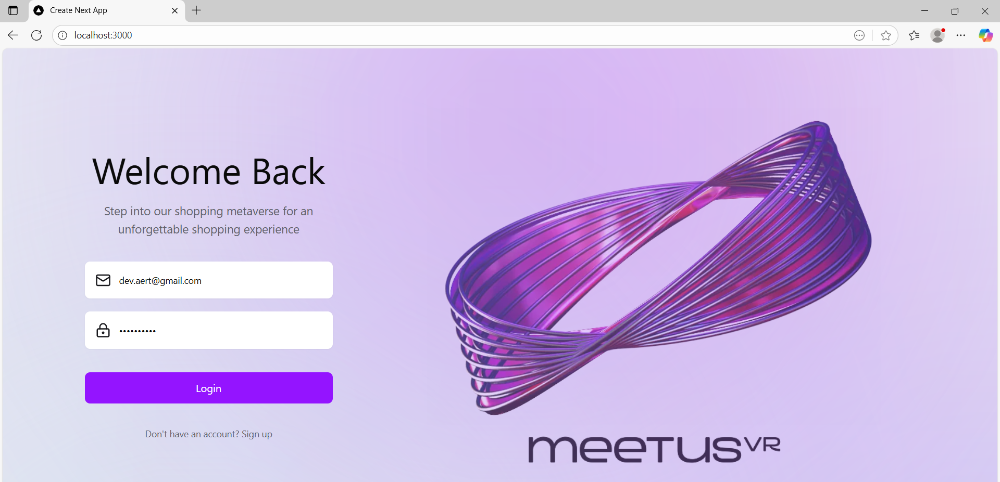
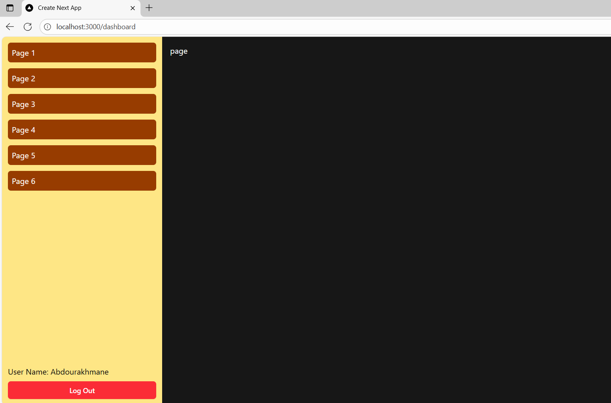

# Task MeetUsar

This is a **Next.js** project implementing a **Login & Dashboard** system following a given Figma design and using a backend API.

You can see the live demo here: [Task MeetUsar on Vercel](https://task-meetusar.vercel.app/)





## Features

- Login form with **React Hook Form** and **Zod** validation
- Authentication using **HTTP-only cookies**
- Dashboard displaying user ID and Name
- Logout functionality
- Proper token saving and expiration handling
- Clean **Next.js** code organization
- SState management using server data directly (instead of a large library like Redux or Zustand)
- Responsive and simple design matching Figma

## Note

We fetched the user directly from the provided endpoint, so there was no need to use a large library like Redux or Zustand for this simple case.

## Goals Implemented

- Implement login form with validation
- Call backend API to authenticate user
- Save token in HTTP-only cookies
- Fetch user info after login
- Fetch user info directly from the server after login
- Display user info in a dashboard
- Logout button to clear session

## Normal Scenario

1. User opens the app at `http://localhost:3000`
2. System checks if authentication exists and is valid
3. Login form displayed:
   - E-Mail
   - Password
   - Login button (disabled if invalid)
4. User logs in with:
   - Email: `dev.aert@gmail.com`
   - Password: `helloworld`
5. System calls login API and stores token
6. System calls user info API and stores ID & Name
7. Dashboard page displayed
8. User can logout

## Exceptional Scenarios

- Invalid email or empty password displays validation errors
- Errors are cleared immediately when input changes

## Non Goals

- JWT or refresh token knowledge not required
- Dashboard design is kept simple


## Getting Started

First, run the development server:

```bash
npm install
npm run dev
